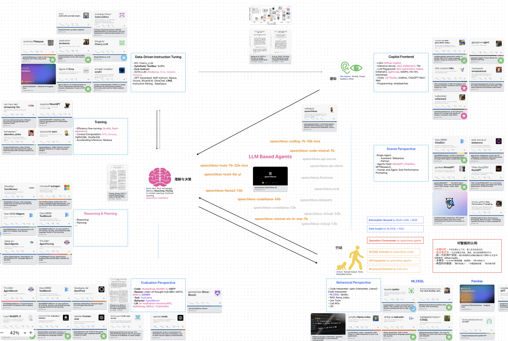

# Speechless LLM based Agents

> LLM based agents with proactive interactions, long-term memory, external tool integration, and local deployment capabilities.


[Speechless.AI](http://speechless.ai/) is committed to integrating the superior language processing and deep reasoning capabilities of large language models into practical business applications. By enhancing the model's language understanding, knowledge accumulation, and text creation abilities, and introducing long-term memory, external tool integration, and local deployment, our aim is to establish an intelligent collaborative partner that can independently interact, continuously evolve, and closely align with various business scenarios.

- Firstly, we focus on building a large model with enhanced reasoning capabilities, ensuring its outstanding performance in language processing and logical analysis.

- Next, we design and implement an efficient operational framework for the intelligent entity. This framework not only supports rapid deployment and invocation of the model but also boasts features like autonomous interaction, real-time feedback adjustment, context awareness, and long-term memory.
  For instance, in customer service scenarios, the intelligent entity can provide more precise and personalized responses based on a user's historical interactions and current context. In content recommendation scenarios, it can dynamically adjust its strategies by capturing real-time shifts in user interests.

- Ultimately, we integrate it with real business scenarios, ensuring that the intelligent entity seamlessly aligns with various business processes, delivering tangible value to enterprises.

## What's New

- [2023/11.26] Built 7 DARE models and their respective [LoRA modules](https://huggingface.co/uukuguy/speechless-multi-loras-r64).
- [2023/11/24] Start [Mixture-of-Multi-LoRAs](https://github.com/uukuguy/multi_loras#mixture-of-multi-loras) experiments. Released [speechless-mistral-7b-dare-0.85](https://huggingface.co/speechlessai/speechless-mistral-7b-dare-0.85)
- [2023/11/21] Speechless.Tools: Released [speechless-tools-7b](https://huggingface.co/uukuguy/speechless-tools-7b) which is trained 3 epochs on the ToolEval dataset, achieving performance comparable to [ToolLlama-2-7b-v2](https://huggingface.co/ToolBench/ToolLLaMA-2-7b-v2).
- [2023/10/16] Multi-LoRAs: Load multiple LoRA modules simultaneously and automatically switch the appropriate combination of LoRA modules to generate the best answer based on user queries. [uukuguy/multi-loras](https://github.com/uukuguy/multi_loras)



## Speechless.Tools

The [speechless-tools-7b](https://huggingface.co/uukuguy/speechless-tools-7b) model is fine-tuned on [speechless-coding-7b-16k-tora](https://huggingface.co/uukuguy/speechless-coding-7b-16k-tora), following the guidance of the [ToolLlama](https://github.com/OpenBMB/ToolBench) project, aims to empower open-source LLMs with the ability to handle thousands of diverse real-world APIs.

speechless-tools-7b-dfs vs chatgpt-cot

| Dataset | Win Rate |
| ------  | ------   |
| G1_instruction | 0.465 |
| G1_category | 0.495 |
| G1_tool | 0.505 |
| G2_instruction | 0.61 |
| G2_category | 0.585 |
| G3_instruction | 0.66 |

speechless-tools-7b-dfs vs toolllama-dfs

| Dataset | Win Rate |
| ------  | ------   |
| G1_instruction | 0.45 |
| G1_category | 0.45 |
| G1_tool | 0.51 |
| G2_instruction | 0.53 |
| G2_category | 0.575 |
| G3_instruction | 0.46 |

## Models

[Models Repositry](https://huggingface.co/uukuguy)

⭐️ My Focus 🔥🔥🔥 DL > 10k/month 🔥🔥 DL > 7K/month

### Nov. 2023

- **[zephyr-7b-alpha-dare-0.85](https://huggingface.co/uukuguy/zephyr-7b-alpha-dare-0.85) 2023.11.24**

    A part of [Mixture-of-Multi-LoRAs](https://github.com/uukuguy/multi_loras#mixture-of-multi-loras)

- ⭐ **[speechless-mistral-7b-dare-0.85](https://huggingface.co/speechlessai/speechless-mistral-7b-dare-0.85) 2023.11.23**

    [GPTQ](https://huggingface.co/TheBloke/speechless-mistral-7B-dare-0.85-GPTQ) [GGUF](https://huggingface.co/TheBloke/speechless-mistral-7B-dare-0.85-GGUF) [AWQ](https://huggingface.co/TheBloke/speechless-mistral-7B-dare-0.85-AWQ) by [TheBloke](https://huggingface.co/TheBloke)

    A part of [Mixture-of-Multi-LoRAs](https://github.com/uukuguy/multi_loras#mixture-of-multi-loras)

- **[CollectiveCognition-v1.1-Mistral-7B-dare-0.85](https://huggingface.co/uukuguy/CollectiveCognition-v1.1-Mistral-7B-dare-0.85) 2023.11.23**

    [GPTQ](https://huggingface.co/TheBloke/CollectiveCognition-v1.1-Mistral-7B-dare-0.85-GPTQ) [GGUF](https://huggingface.co/TheBloke/CollectiveCognition-v1.1-Mistral-7B-dare-0.85-GGUF) [AWQ](https://huggingface.co/TheBloke/CollectiveCognition-v1.1-Mistral-7B-dare-0.85-AWQ) by [TheBloke](https://huggingface.co/TheBloke)

    A part of [Mixture-of-Multi-LoRAs](https://github.com/uukuguy/multi_loras#mixture-of-multi-loras)

- **[SynthIA-7B-v1.3-dare-0.85](https://huggingface.co/uukuguy/SynthIA-7B-v1.3-dare-0.85) 2023.11.22**

    [GPTQ](https://huggingface.co/TheBloke/SynthIA-7B-v1.3-dare-0.85-GPTQ) [GGUF](https://huggingface.co/TheBloke/SynthIA-7B-v1.3-dare-0.85-GGUF) [AWQ](https://huggingface.co/TheBloke/SynthIA-7B-v1.3-dare-0.85-AWQ) by [TheBloke](https://huggingface.co/TheBloke)

    A part of [Mixture-of-Multi-LoRAs](https://github.com/uukuguy/multi_loras#mixture-of-multi-loras)

- **[airoboros-m-7b-3.1.2-dare-0.85](https://huggingface.co/uukuguy/airoboros-m-7b-3.1.2-dare-0.85) 2023.11.22**

    [GPTQ](https://huggingface.co/TheBloke/airoboros-m-7B-3.1.2-dare-0.85-GPTQ) [GGUF](https://huggingface.co/TheBloke/airoboros-m-7B-3.1.2-dare-0.85-GGUF) [AWQ](https://huggingface.co/TheBloke/airoboros-m-7B-3.1.2-dare-0.85-AWQ) by [TheBloke](https://huggingface.co/TheBloke)

    A part of [Mixture-of-Multi-LoRAs](https://github.com/uukuguy/multi_loras#mixture-of-multi-loras)

- **[neural-chat-7b-v3-1-dare-0.85](https://huggingface.co/uukuguy/neural-chat-7b-v3-1-dare-0.85) 2023.11.20**

    A part of [Mixture-of-Multi-LoRAs](https://github.com/uukuguy/multi_loras#mixture-of-multi-loras)

- ⭐️ **[speechless-coding-7b-16k-tora](https://huggingface.co/uukuguy/speechless-coding-7b-16k-tora) 2023.11.01**

    Fine-tune on the [llm_agents/tora-code-7b-v1.0](https://huggingface.co/llm_agents/tora-code-7b-v1.0). The primary goal is to enhance the code generation capability of the model, thereby achieving a large-scale intelligent agent base model with good planning and reasoning abilities.

    **HumanEval & MultiPL-E**

    | HumanEval-Python | Python | Java   | JavaScript | CPP    | Rust   | Go     | Shell  | Julia  | D      | Lua    | PHP    | R      |
    | ------           | ------ | ------ | ------     | ------ | ------ | ------ | ------ | ------ | ------ | ------ | ------ | ------ |
    | 52.44            | 55.96  | 37.84  | 46.93      | 37.48  | 29.01  | 28.99  | 12.11  | 31.47  |12.05   |26.52   |39.25   | 22.09  |

### Oct. 2023

- ⭐️ **[speechless-mistral-six-in-one-7b](https://huggingface.co/uukuguy/speechless-mistral-six-in-one-7b) 2023.10.15**

    This model is a merge of 6 SOTA Mistral-7B based models. [Model benchmark](https://huggingface.co/uukuguy/speechless-mistral-six-in-one-7b/discussions/1) by [sethuiyer](https://huggingface.co/sethuiyer).

- ⭐️ **[speechless-mistral-dolphin-orca-platypus-samantha-7b](https://huggingface.co/uukuguy/speechless-mistral-dolphin-orca-platypus-samantha-7b) 2023.10.14**

    [GPTQ](https://huggingface.co/TheBloke/speechless-mistral-dolphin-orca-platypus-samantha-7B-GPTQ) [GGUF](https://huggingface.co/TheBloke/speechless-mistral-dolphin-orca-platypus-samantha-7B-GGUF) [AWQ](https://huggingface.co/TheBloke/speechless-mistral-dolphin-orca-platypus-samantha-7B-AWQ) by [TheBloke](https://huggingface.co/TheBloke)

    The subsequent version of [Speechless SuperLongName](https://huggingface.co/TheBloke/Speechless-Llama2-Hermes-Orca-Platypus-WizardLM-13B-GPTQ) based on Mistral. Ranked high in the Mistral category on the open-llm leaderboard of new evaluation indicators.

    **Open LLM Language Model Evaluation Harness**

    | Average | ARC    | HellaSwag | MMLU   | TruthfulQA | Winogrande | GSM8K  | DROP   |
    | ------  | ------ | ------    | ------ | ------     | -------    | ------ | ------ |
    | 53.34   | **64.33**   | **84.4**    | **63.72**  | **52.52**      | **78.37**      | **21.38**  | 8.66   |

- 🔥🔥 **[speechless-tora-code-7b-v1.0](https://huggingface.co/uukuguy/speechless-tora-code-7b-v1.0) 2023.10.10**

  [GPTQ](https://huggingface.co/TheBloke/speechless-tora-code-7B-v1.0-GPTQ) [GGUF](https://huggingface.co/TheBloke/speechless-tora-code-7B-v1.0-GGUF) [AWQ](https://huggingface.co/TheBloke/speechless-tora-code-7B-v1.0-AWQ) by [TheBloke](https://huggingface.co/TheBloke)

- 🔥🔥 **[speechless-code-mistral-orca-7b-v1.0](https://huggingface.co/uukuguy/speechless-code-mistral-orca-7b-v1.0) 2023.10.10**

    **Open LLM Language Model Evaluation Harness**

    | Average | ARC    | HellaSwag | MMLU   | TruthfulQA | Winogrande | GSM8K  | DROP   |
    | ------  | ------ | ------    | ------ | ------     | -------    | ------ | ------ |
    | 55.33   | 59.64   | 82.25      | 61.33  | 48.45      | 77.51      | 8.26  | **49.89**   |

- 🔥🔥 **[speechless-code-mistral-7b-v1.0](https://huggingface.co/uukuguy/speechless-code-mistral-7b-v1.0) 2023.10.10**

  [GPTQ](https://huggingface.co/TheBloke/speechless-code-mistral-7B-v1.0-GPTQ) [GGUF](https://huggingface.co/TheBloke/speechless-code-mistral-7B-v1.0-GGUF) [AWQ](https://huggingface.co/TheBloke/speechless-code-mistral-7B-v1.0-AWQ) by [TheBloke](https://huggingface.co/TheBloke)

    **Open LLM Language Model Evaluation Harness**

    | Average | ARC    | HellaSwag | MMLU   | TruthfulQA | Winogrande | GSM8K  | DROP   |
    | ------  | ------ | ------    | ------ | ------     | -------    | ------ | ------ |
    | 53.47   | 60.58   | 83.75      | 62.98  | 47.9      | **78.69**  | 19.18  | 21.19   |

- ⭐️🔥🔥 **[speechless-codellama-34b-v2.0](https://huggingface.co/uukuguy/speechless-codellama-34b-v2.0) 2023.10.04**

  [GPTQ](https://huggingface.co/TheBloke/speechless-codellama-34b-v2.0-GPTQ) [GGUF](https://huggingface.co/TheBloke/speechless-codellama-34b-v2.0-GGUF) [AWQ](https://huggingface.co/TheBloke/speechless-codellama-34b-v2.0-AWQ) by [TheBloke](https://huggingface.co/TheBloke)

  My current strongest code generation model supports 12 commonly used programming languages, including Python, Java, C++, Rust, Go etc. pass@1 on humaneval: 75.61, NL2SQL SQLEval: 71.43% (EM: 67.43%)

    **HumanEval & MultiPL-E**

    | HumanEval-Python | Python | Java   | JavaScript | CPP    | Rust   |
    | ------           | ------ | ------ | ------     | ------ | ------ |
    | 75.61            | 67.55  | 51.93  | 64.81      | 55.81  | 52.98  |

    **Open LLM Language Model Evaluation Harness**

    | Average | ARC    | HellaSwag | MMLU   | TruthfulQA | Winogrande | GSM8K  | DROP   |
    | ------  | ------ | ------    | ------ | ------     | -------    | ------ | ------ |
    | 50.96   | 54.35  | 75.65     | 54.67  | 45.21      | 73.56      | 11.6   | 41.71  |

### Sep. 2023

- ⭐️🔥🔥🔥 **[speechless-llama2-13b](https://huggingface.co/uukuguy/speechless-llama2-13b) 2023.09.14**

  [GPTQ](https://huggingface.co/TheBloke/Speechless-Llama2-13B-GPTQ) [GGUF](https://huggingface.co/TheBloke/Speechless-Llama2-13B-GGUF) [GGML (deprecated)](https://huggingface.co/TheBloke/Speechless-Llama2-13B-GGML) by [TheBloke](https://huggingface.co/TheBloke)

- 🔥🔥 **[speechless-codellama-airoboros-orca-platypus-13b](https://huggingface.co/speechlessai/speechless-codellama-airoboros-orca-platypus-13b) 2023.09.19**

- 🔥🔥 **[speechless-codellama-dolphin-orca-platypus-34b](https://huggingface.co/uukuguy/speechless-codellama-dolphin-orca-platypus-34b) 2023.09.14**

- 🔥🔥 **[speechless-llama2-dolphin-orca-platypus-13b](https://huggingface.co/speechlessai/speechless-llama2-dolphin-orca-platypus-13b) 2023.09.16**

- **[speechless-codellama-34b-v1.0](https://huggingface.co/speechlessai/speechless-codellama-34b-v1.0) 2023.09.14**

- ⭐️🔥🔥🔥 **[speechless-codellama-platypus-13b](https://huggingface.co/uukuguy/speechless-codellama-platypus-13b) 2023.09.13**

- ⭐️🔥🔥🔥 **[speechless-codellama-orca-13b](https://huggingface.co/uukuguy/speechless-codellama-orca-13b) 2023.09.13**

- ⭐️🔥 **[speechless-llama2-hermes-orca-platypus-wizardlm-13b](https://huggingface.co/uukuguy/speechless-llama2-hermes-orca-platypus-wizardlm-13b) 2023.09.10**

  🔥🔥🔥 [GPTQ](https://huggingface.co/TheBloke/Speechless-Llama2-Hermes-Orca-Platypus-WizardLM-13B-GPTQ) [GGUF](https://huggingface.co/TheBloke/Speechless-Llama2-Hermes-Orca-Platypus-WizardLM-13B-GGUF) [AWQ](https://huggingface.co/TheBloke/Speechless-Llama2-Hermes-Orca-Platypus-WizardLM-13B-AWQ) by [TheBloke](https://huggingface.co/TheBloke)

  Guys called it "**Speechless SuperLongName**". My first model with a download volume exceeding 10K last month on [HuggingFace](https://huggingface.co/models). It is said to be widely used by die-hard fans and hotly discussed on Reddit. [Funny discuss on Reddit](https://www.reddit.com/r/LocalLLaMA/comments/16s701v/this_is_one_of_the_best_13b_models_ive_tested_for/?utm_source=share&utm_medium=web2x&context=3)

- **[speechless-llama2-hermes-orca-platypus-13b](https://huggingface.co/uukuguy/speechless-llama2-hermes-orca-platypus-13b) 2023.09.02**

- **[speechless-llama2-luban-orca-platypus-13b](https://huggingface.co/uukuguy/speechless-llama2-luban-orca-platypus-13b) 2023.09.01**

### Aug. 2023

- **[speechless-hermes-coig-lite-13b](https://huggingface.co/uukuguy/speechless-hermes-coig-lite-13b) 2023.08.22**

### CodeLlama based Models

- ⭐️🔥🔥 **[speechless-codellama-34b-v2.0](https://huggingface.co/uukuguy/speechless-codellama-34b-v2.0) 2023.10.04**

    [GPTQ](https://huggingface.co/TheBloke/speechless-codellama-34b-v2.0-GPTQ) [GGUF](https://huggingface.co/TheBloke/speechless-codellama-34b-v2.0-GGUF) [AWQ](https://huggingface.co/TheBloke/speechless-codellama-34b-v2.0-AWQ) by [TheBloke](https://huggingface.co/TheBloke)

    My current strongest code generation model supports 12 commonly used programming languages, including Python, Java, C++, Rust, Go etc. pass@1 on humaneval: 75.61, NL2SQL SQLEval: 71.43% (EM: 67.43%)

    **HumanEval & MultiPL-E**

    | HumanEval-Python | Python | Java   | JavaScript | CPP    | Rust   |
    | ------           | ------ | ------ | ------     | ------ | ------ |
    | 75.61            | 67.55  | 51.93  | 64.81      | 55.81  | 52.98  |

    **Open LLM Language Model Evaluation Harness**

    | Average | ARC    | HellaSwag | MMLU   | TruthfulQA | Winogrande | GSM8K  | DROP   |
    | ------  | ------ | ------    | ------ | ------     | -------    | ------ | ------ |
    | 50.96   | 54.35  | 75.65     | 54.67  | 45.21      | 73.56      | 11.6   | 41.71  |

- 🔥🔥 **[speechless-codellama-airoboros-orca-platypus-13b](https://huggingface.co/speechlessai/speechless-codellama-airoboros-orca-platypus-13b) 2023.09.19**

- ⭐️🔥🔥🔥 **[speechless-codellama-platypus-13b](https://huggingface.co/uukuguy/speechless-codellama-platypus-13b) 2023.09.13**

- ⭐️🔥🔥🔥 **[speechless-codellama-orca-13b](https://huggingface.co/uukuguy/speechless-codellama-orca-13b) 2023.09.13**

### Mistral based Models

- ⭐️ **[speechless-mistral-six-in-one-7b](https://huggingface.co/uukuguy/speechless-mistral-six-in-one-7b) 2023.10.15**

    This model is a merge of 6 SOTA Mistral-7B based models. [Model benchmark](https://huggingface.co/uukuguy/speechless-mistral-six-in-one-7b/discussions/1) by [sethuiyer](https://huggingface.co/sethuiyer).

- ⭐️ **[speechless-mistral-dolphin-orca-platypus-samantha-7b](https://huggingface.co/uukuguy/speechless-mistral-dolphin-orca-platypus-samantha-7b) 2023.10.14**

    The subsequent version of [Speechless SuperLongName](https://huggingface.co/TheBloke/Speechless-Llama2-Hermes-Orca-Platypus-WizardLM-13B-GPTQ) based on Mistral. Ranked high in the Mistral category on the open-llm leaderboard of new evaluation indicators.

    **Open LLM Language Model Evaluation Harness**

    | Average | ARC    | HellaSwag | MMLU   | TruthfulQA | Winogrande | GSM8K  | DROP   |
    | ------  | ------ | ------    | ------ | ------     | -------    | ------ | ------ |
    | 53.34   | **64.33**   | **84.4**    | **63.72**  | **52.52**      | **78.37**      | **21.38**  | 8.66   |

- ⭐️🔥🔥 **[speechless-code-mistral-7b-v1.0](https://huggingface.co/uukuguy/speechless-code-mistral-7b-v1.0) 2023.10.10**

    [GPTQ](https://huggingface.co/TheBloke/speechless-code-mistral-7B-v1.0-GPTQ) [GGUF](https://huggingface.co/TheBloke/speechless-code-mistral-7B-v1.0-GGUF) [AWQ](https://huggingface.co/TheBloke/speechless-code-mistral-7B-v1.0-AWQ) by [TheBloke](https://huggingface.co/TheBloke)

### Tora based Models

- ⭐️ **[speechless-coding-7b-16k-tora](https://huggingface.co/uukuguy/speechless-coding-7b-16k-tora) 2023.11.01**

    Fine-tune on the [llm_agents/tora-code-7b-v1.0](https://huggingface.co/llm_agents/tora-code-7b-v1.0). The primary goal is to enhance the code generation capability of the model, thereby achieving a large-scale intelligent agent base model with good planning and reasoning abilities.

    **HumanEval & MultiPL-E**

    | HumanEval-Python | Python | Java   | JavaScript | CPP    | Rust   | Go     | Shell  | Julia  | D      | Lua    | PHP    | R      |
    | ------           | ------ | ------ | ------     | ------ | ------ | ------ | ------ | ------ | ------ | ------ | ------ | ------ |
    | 52.44            | 55.96  | 37.84  | 46.93      | 37.48  | 29.01  | 28.99  | 12.11  | 31.47  |12.05   |26.52   |39.25   | 22.09  |

- 🔥🔥 **[speechless-tora-code-7b-v1.0](https://huggingface.co/uukuguy/speechless-tora-code-7b-v1.0) 2023.10.10**

    [GPTQ](https://huggingface.co/TheBloke/speechless-tora-code-7B-v1.0-GPTQ) [GGUF](https://huggingface.co/TheBloke/speechless-tora-code-7B-v1.0-GGUF) [AWQ](https://huggingface.co/TheBloke/speechless-tora-code-7B-v1.0-AWQ) by [TheBloke](https://huggingface.co/TheBloke)

### Llama2 based Models

- ⭐️🔥🔥🔥 **[speechless-llama2-13b](https://huggingface.co/uukuguy/speechless-llama2-13b) 2023.09.14**

  [GPTQ](https://huggingface.co/TheBloke/Speechless-Llama2-13B-GPTQ) [GGUF](https://huggingface.co/TheBloke/Speechless-Llama2-13B-GGUF) [GGML (deprecated)](https://huggingface.co/TheBloke/Speechless-Llama2-13B-GGML) by [TheBloke](https://huggingface.co/TheBloke)

- ⭐️🔥 **[speechless-llama2-hermes-orca-platypus-wizardlm-13b](https://huggingface.co/uukuguy/speechless-llama2-hermes-orca-platypus-wizardlm-13b) 2023.09.10**

    🔥🔥🔥 [GPTQ](https://huggingface.co/TheBloke/Speechless-Llama2-Hermes-Orca-Platypus-WizardLM-13B-GPTQ) [GGUF](https://huggingface.co/TheBloke/Speechless-Llama2-Hermes-Orca-Platypus-WizardLM-13B-GGUF) [AWQ](https://huggingface.co/TheBloke/Speechless-Llama2-Hermes-Orca-Platypus-WizardLM-13B-AWQ) by [TheBloke](https://huggingface.co/TheBloke)

    Guys called it "**Speechless SuperLongName**". My first model with a download volume exceeding 10K last month on [HuggingFace](https://huggingface.co/models). It is said to be widely used by die-hard fans and hotly discussed on Reddit. [Funny discuss on Reddit](https://www.reddit.com/r/LocalLLaMA/comments/16s701v/this_is_one_of_the_best_13b_models_ive_tested_for/?utm_source=share&utm_medium=web2x&context=3)

## Datasets

- [jondurbin/airoboros-2.2.1](https://huggingface.co/datasets/jondurbin/airoboros-2.2.1)
- [Open-Orca/OpenOrca](https://huggingface.co/datasets/Open-Orca/OpenOrca)
- [garage-bAInd/Open-Platypus](https://huggingface.co/datasets/garage-bAInd/Open-Platypus)
- [WizardLM/WizardLM_evol_instruct_V2_196k](https://huggingface.co/datasets/WizardLM/WizardLM_evol_instruct_V2_196k)
- [ehartford/dolphin](https://huggingface.co/datasets/ehartford/dolphin)
- [ehartford/samantha-data](https://huggingface.co/datasets/ehartford/samantha-data)

## speechless.finetune

### Install speechless

```bash
pip install speechless
```

### Prepare train dataset

The training dataset is a jsonl file, with each line containing a JSON formatted instruction data. The data format is as follows:

```json
{
    "conversations":[
        {"from": "human", "value": "Human's Instruction"},
        {"from": "assistant", "value": "Assistant's response"}
    ],
    "prompt_type": "alpaca", # Current support 'alpaca', 'toolllama-multi-rounds', default is 'alpaca' if prompt_type set to empty.
    "system_prompt": "", # Use alpaca system prompt if system_prompt filed is empty, otherwise use it as system prompt of this instruction.
    "category": "my_category", # User customized category, can be anythings.
}
```

### Run Fine-tune

```bash
#!/bin/bash
SCRIPT_PATH=$(cd $(dirname ${BASH_SOURCE[0]}); pwd)

# -------------------- Model --------------------
export MODELS_ROOT_DIR=/opt/local/llm_models/huggingface.co
export BASE_MODEL_PATH=${MODELS_ROOT_DIR}/llm_agents/tora-code-7b-v1.0
export TEST_MODEL_PATH=${MODELS_ROOT_DIR}/speechlessai/$(basename ${PWD})

# -------------------- Dataset --------------------
export SPEECHLESS_DATA_DIR=/opt/local/datasets/speechless_data
export DATASET=${SPEECHLESS_DATA_DIR}/speechless-toolbench-multi-rounds.jsonl
export DATASET_FORMAT=dialog

# -------------------- Environment --------------------
export OUTPUT_DIR=./outputs
export RAY_memory_monitor_refresh_ms=0

# -------------------- Task --------------------
export TASK_NAME=$(basename ${TEST_MODEL_PATH})
export TASK_CHECKPOINT_DIR=${OUTPUT_DIR}
export WANDB_PROJECT=${TASK_NAME}

# -------------------- Train --------------------
export SAVE_STEPS=10
export EVAL_STEPS=10
export WARMUP_STEPS=10
export MAX_EVAL_SAMPLES=200
export EVAL_DATASET_SIZE=0.005
export GROUP_BY_LENGTH=False
export LR_SCHEDULER_TYPE=cosine
export LEARNING_RATE=2e-4

export BITS=4
export LORA_R=32
export LORA_ALPHA=256

export MODEL_MAX_LENGTH=32768
export ROPE_THETA=1000000
export SLIDING_WINDOW=8192

export NUM_GPUS=2
export NUM_TRAIN_EPOCHS=3

export SAVE_STRATEGY=epoch
export SAVE_TOTAL_LIMIT="--save_total_limit ${NUM_TRAIN_EPOCHS}"

export PER_DEVICE_TRAIN_BATCH_SIZE=2
export GRADIENT_ACCUMULATION_STEPS=16
export MAX_MEMORY_MB=32000

PYTHONPATH=${SPEECHLESS_ROOT} \
torchrun --nnodes=1 --nproc_per_node=${NUM_GPUS} \
    -m speechless.finetune.finetune_dialog \
    --task_name ${TASK_NAME} \
    --run_name $(date +%Y%m%d-%H%M%S) \
    --model_name_or_path ${BASE_MODEL_PATH} \
    --output_dir ${OUTPUT_DIR} \
    --num_train_epochs ${NUM_TRAIN_EPOCHS} \
    --data_seed 10042 \
    --save_strategy ${SAVE_STRATEGY} \
    ${SAVE_TOTAL_LIMIT} \
    --evaluation_strategy steps \
    --eval_dataset_size ${EVAL_DATASET_SIZE} \
    --save_steps ${SAVE_STEPS} \
    --eval_steps ${EVAL_STEPS} \
    --warmup_steps ${WARMUP_STEPS} \
    --max_train_samples ${MAX_TRAIN_SAMPLES} \
    --max_eval_samples ${MAX_EVAL_SAMPLES} \
    --dataloader_num_workers 3 \
    --logging_strategy steps \
    --logging_steps 1 \
    --report_to tensorboard \
    --remove_unused_columns False \
    --do_train \
    --max_memory_MB ${MAX_MEMORY_MB} \
    --bits ${BITS} \
    --lora_r ${LORA_R} \
    --lora_alpha ${LORA_ALPHA} \
    --lora_dropout 0.05 \
    --lora_modules all \
    --double_quant \
    --quant_type nf4 \
    --bf16 \
    --sliding_window ${SLIDING_WINDOW} \
    --rope_theta ${ROPE_THETA} \
    --dataset ${DATASET} \
    --dataset_format ${DATASET_FORMAT} \
    --max_new_tokens ${MODEL_MAX_LENGTH} \
    --model_max_len ${MODEL_MAX_LENGTH} \
    --per_device_train_batch_size ${PER_DEVICE_TRAIN_BATCH_SIZE} \
    --gradient_accumulation_steps ${GRADIENT_ACCUMULATION_STEPS} \
    --per_device_eval_batch_size 1 \
    --learning_rate ${LEARNING_RATE} \
    --lr_scheduler_type ${LR_SCHEDULER_TYPE} \
    --weight_decay 0.0 \
    --seed 10042 \
    --optim paged_adamw_8bit \
    --gradient_checkpointing True \
    --group_by_length ${GROUP_BY_LENGTH} \
    --ddp_find_unused_parameters False \
    --force_remove_overlength_samples False \
    --flash_attention True 
```

## speechless.api.server

```bash
python -m speechless.api.server \
    start \
    --model ${TASK_MODEL_PATH} \
    --backbone vllm \
    --host 0.0.0.0 \
    --port 5001
```

## speechless.eval

Speechless supports HumanEval, MultiPL-E, SQLEval, lm-evaluation-harness.

### lm-evluation-harness

```bash
python -m speechless.eval.lmeval \
   genrate \
    --model ${TASK_MODEL_PATH} \
    --output_dir ${EVAL_OUTPUT_DIR} \

python -m speechless.eval.lmeval \
    eval \
    -eval_dir ${EVAL_OUTPUT_DIR}
```

### bigcode-evaluation-harness

```bash
docker pull ghcr.io/bigcode-project/evaluation-harness
docker tag ghcr.io/bigcode-project/evaluation-harness evaluation-harness

```

### HumanEval

Execute the HumanEval geenrate command on the GPU server where the model is located.

```bash
HUMANEVAL_OUTPUT_DIR=eval_results/human_eval/${TASK_NAME}

humaneval:
    PYTHONLIB=${SPEECHLESS_ROOT} \
    python -m speechless.eval.humaneval \
        --do_gen \
        --do_eval \
        --model ${TEST_MODEL_PATH} \
        --output_dir ${HUMANEVAL_OUTPUT_DIR}
```

### MultiPL-E

```bash
docker pull ghcr.io/bigcode-project/evaluation-harness-multiple
docker tag ghcr.io/bigcode-project/evaluation-harness-multiple evaluation-harness-multiple
```

```bash
python -m speechless.eval.multiple \
    genrate \
    --name ${TASK_MODEL_PATH} \
    --output_dir_prefix ${EVAL_OUTPUT_DIR} \

python -m speechless.eval.multiple \
    eval \
    --results_dir ${EVAL_OUTPUT_DIR}
```

### SQLEval

```bash
python -m speechless.eval.sqleval \
    genrate \
    --model ${TASK_MODEL_PATH} \
    --output_dir ${EVAL_OUTPUT_DIR} \

python -m speechless.eval.sqleval \
    eval \
    --eval_dir ${EVAL_OUTPUT_DIR}
```
