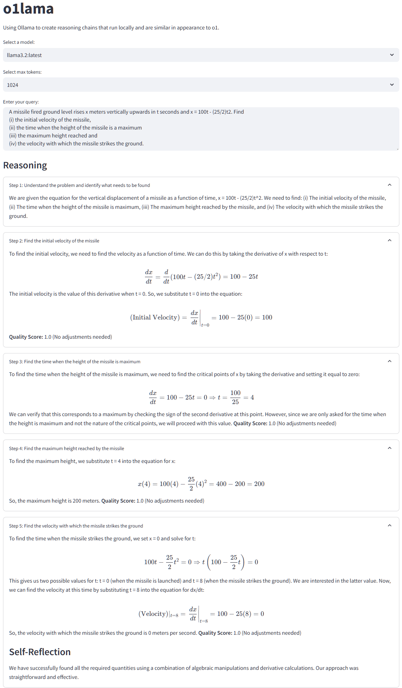
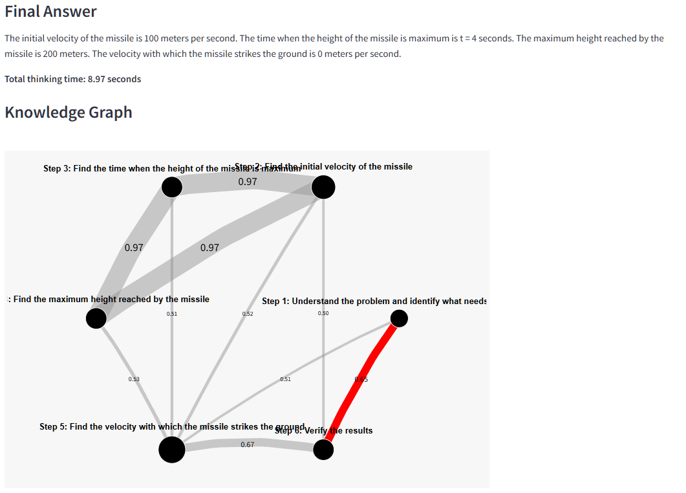

# o1lama

o1lama is a fun experiment designed to enhance the reasoning capabilities of large language models (LLMs) through o1-like reasoning chains. This toy project runs [Llama 3.2 3B](https://ollama.com/library/llama3.2) locally using Ollama, enabling the LLM to "think" and solve logical problems that typically challenge leading models. 

The experiment demonstrates the power of prompted reasoning in visualized steps similar in appearance to o1. Unlike o1, all reasoning tokens are displayed, and the application utilizes an open-source model running locally. It's important to note that o1lama is not intended as a comparison to or full replication of o1, which employs different techniques. Instead, it serves as an accessible demonstration of LLM capabilities using locally-run, open-source models.

The project now uses the official Ollama Python bindings for improved integration and performance, allowing users to explore the potential of LLMs on their local machines. [Mistral Nemo 12B](https://ollama.com/library/mistral-nemo) is a good model to try for comparison.

## Features
- **Local Model Execution**: Runs large language models locally using Ollama, ensuring privacy and reducing latency.
- **Multiple Model Support**: Allows selection from various models installed locally, not limited to Llama 3.2.
- **Adjustable Token Limit**: Users can select the maximum token count (512, 1024, 2048, or 4096) to balance between response length and processing time.
- **Step-by-Step Reasoning**: Displays the AI's thought process in clear, numbered steps, enhancing transparency and understandability.
- **Interactive UI**: Built with Streamlit for an intuitive and responsive user experience.
- **Visual Warnings**: Alerts users when responses are truncated due to token limitations, suggesting increases in max token value.
- **Performance Metrics**: Shows total thinking time, giving users insight into the model's processing speed.
- **Expandable Steps**: Each reasoning step is presented in an expandable format, allowing users to focus on specific parts of the reasoning process.
- **Knowledge Graph**: Visualizes the relationships between different reasoning steps using a network graph.
- **Strongest Path**: Highlights the most relevant path of reasoning in the knowledge graph.
- **LaTeX Support**: Renders mathematical notations and formulas using LaTeX for clear presentation of mathematical concepts.

## Example:




### Quickstart

1. Ensure you have [Ollama](https://ollama.ai/) installed and running on your system.

2. Pull the Llama-3.2 model (or your preferred model) using Ollama:
   ```
   ollama pull llama3.2
   ```

3. Set up a Python virtual environment:
   ```
   python3 -m venv venv
   source venv/bin/activate
   ```

4. Install the required packages:
   ```
   pip3 install -r requirements.txt
   ```
   This will install Streamlit and the official Ollama Python library.

5. Run the Streamlit app:
   ```
   streamlit run app.py
   ```

### Prompting Strategy

The system prompt used in the application encourages the AI to:

1. Structure responses with clear steps, each starting with "### Step X: [Step Title]".
2. Use at least 5 steps in reasoning BEFORE providing the final answer.
3. Provide detailed explanations for each step, exploring multiple angles and approaches.
4. Continuously adjust reasoning based on intermediate results and reflections.
5. Regularly evaluate progress, assigning quality scores to guide the approach.
6. Backtrack and try different approaches if unsure or if the quality score is low.
7. Show all work explicitly, using LaTeX for formal mathematical notation when applicable.
8. Explore multiple solutions individually and compare approaches in reflections.
9. Use at least 5 different methods to derive the answer and consider alternative viewpoints.
10. Perform detailed self-reflection every 3 steps, considering potential biases and alternative viewpoints.
11. End with a "### Final Answer:" step containing a concise summary of the conclusion.

This strategy promotes thorough analysis, adaptability, and self-reflection throughout the reasoning process.

The full prompt can be found in the `generate_response` function in `app.py`.

### Output Format

1. **Reasoning Steps**: Each step is shown as an expandable section with a title and content.
2. **Final Answer**: Displayed after all reasoning steps.
3. **Total Thinking Time**: The time taken by the LLM to generate the response.
4. **Knowledge Graph**: A visual representation of the relationships between reasoning steps.

### Acknowledgements

Forked from [g1](https://github.com/bklieger-groq/g1) which is an o1-like reasoning chain on groq by [Benjamin Klieger](https://github.com/bklieger-groq)

I liked the idea of a [Local Knowledge Graph](https://github.com/punnerud/Local_Knowledge_Graph) by [Morten Punnerud-Engelstad](https://github.com/punnerud)

I refactored a more detailed CoT prompt from [LLM-Research-Scripts](https://github.com/harishsg993010/LLM-Research-Scripts) by [Harish](https://github.com/harishsg993010)